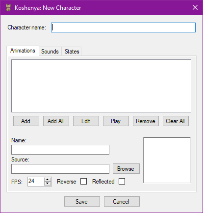
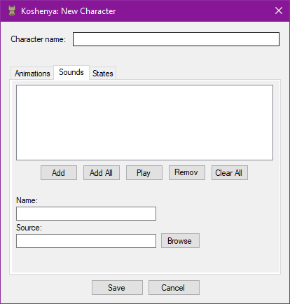
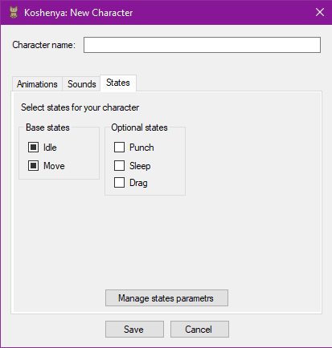
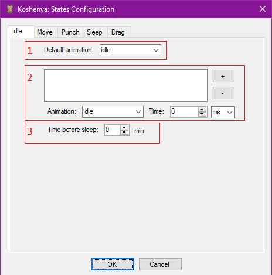
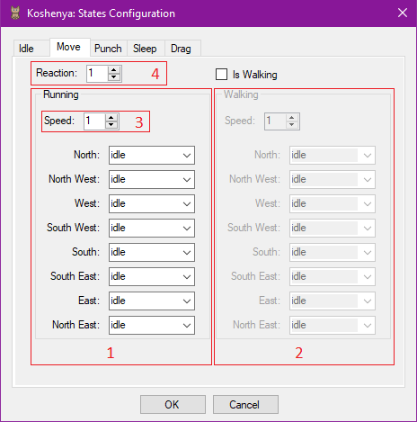
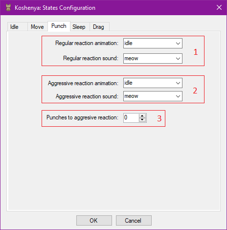
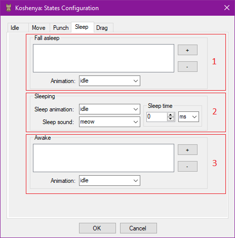
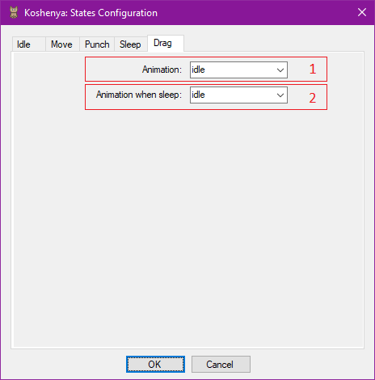

# Koshenya

Koshenya is a lightweight desktop toy inspired by the classic [Neko](https://en.wikipedia.org/wiki/Neko_(software)) game.  
It features a customizable animated character that interacts with your mouse cursor — chasing it, reacting to clicks, falling asleep, and more.

---

## 📚 Table of Contents

- [🎮 About the Project](#-about-the-project)
- [✨ Features](#-features)
- [📦 Download & Releases](#-download--releases)
- [🚀 Launch](#-launch)
- [🧩 Character System](#-character-system)
  - [Character Selection](#character-selection)
  - [Creating a New Character](#creating-a-new-character)
  - [Core Components](#core-components)
- [🐾 Step-by-Step Editor Guide](#-step-by-step-editor-guide)
- [📄 License](#-license)
- [🔗 Links](#-links)

---

## 🎮 About the Project

Koshenya is a playful desktop application where an animated character follows your cursor and responds to user interactions.  
The key idea is to provide a flexible platform where anyone can replace the default cat with their own character — complete with custom animations, sounds, and behaviors.

---

## ✨ Features

- Customizable characters with animations and sounds  
- Flexible state system: idle, move, sleep, drag, punch  
- Visual editor for creating new characters  
- Support for animation clips and mirrored playback  

---

## 📦 Download & Releases

You can download the latest version of Koshenya from the [Releases](https://github.com/4emploxmouhik/koshenya/releases) section on GitHub.

### 🔽 How to Download

1. Go to the [Releases page](https://github.com/4emploxmouhik/Koshenya/releases)
2. Find the latest release at the top
3. Download the file named `Koshenya.exe` (or the ZIP archive if available)
4. Run the application — no installation required

> If your system does not have **.NET Framework 4.6** or higher, you may need to install it first:  
> [Download .NET Framework 4.6](https://www.microsoft.com/en-us/download/details.aspx?id=48130)

### 📁 Portable Mode

Koshenya runs in portable mode — all configuration and assets are stored locally in the `Assets` folder.  
No registry entries or system modifications are made.


## 🚀 Launch

Launching Koshenya is as simple as running any executable:

```bash 
Koshenya.exe
Koshenya.exe Tosha
```

You can optionally specify a character name as a parameter to activate it on launch.

---

## 🧩 Character System
### Character Selection

Available characters can be selected via the context menu under `Characters`.  
Click on a name to restart the application with the selected character.  
A checkmark indicates the currently active character.

### Creating a New Character

There are two ways to create a new character:

1. **Manual Copy**  
   Duplicate an existing character folder and replace animation frames with your own.  
   To change behavior, edit the `.conf` configuration file.

  > Character files are located in `../Koshenya/Assets`.  
  > Use the `Manage assets` menu item to open this folder.

2. **Graphical Editor**  
   Use the built-in editor via `Create new` in the context menu.  
   Follow the dialog to define animations, sounds, and states.

### Core Components
1. **Animations**  
    Animations are represented as sequences of `.png` frames.
  
    > Each animation must be placed in a separate folder named after the specific action, and each frame file must be named according to its sequence number.
  
    The same frames can be reused for different actions, such as running left and right.  
    When assigning an animation to a character, you can specify playback speed, whether frames should be mirrored horizontally, and whether they should play in reverse order.
  
    For certain actions, it's possible to combine multiple animations into a clip.
  
    A clip consists of a default animation and a list of animations that will play at specified times throughout the clip's duration.  
    This way, for an idle state, you don't need 1000 frames — just a few short animations and their playback timing.  
    The empty space between them will be filled by looping the default animation.

2. **Sounds**  
    Sounds played by the character for specific states are represented by `.wav` files.

3. **States**  
    Each character has two mandatory base states and several optional ones:
    * Idle (base) — the character stays in place and waits for cursor movement.
    * Movement (base) — the character moves toward the cursor or a random point. You can toggle movement via the `Patrol` menu item.
    * Punch — the character reacts to a left-click.
    * Drag — the character is grabbed with the right mouse button and moved anywhere on the screen.
    * Sleep — triggered after a period of inactivity, ignoring the mouse cursor. This state is conditionally divided into three sub-states: falling asleep, sleeping, and waking up.

---

## 🐾 Step-by-Step Editor Guide
### Step 1: Animations



To add an animation to the list, specify its name, the location of the animation folder on your computer, set the frame rate, and optionally indicate whether the frames should be mirrored horizontally or played in reverse order.

> These last two settings are useful when similar actions are reused. For example, running left may be visually identical to running right, just mirrored (assuming the character looks the same from both sides). Thus, multiple animations can share the same source.

After setting all animation parameters, click the `Add` button to add the animation to the list.  
Alternatively, you can add all available animations at once by clicking `Add All` and selecting the root animation folder.

You can preview the added animation by clicking `Play`, which will display the animation in a dedicated window. To stop playback, click `Stop`.

To edit animation parameters, select the desired animation from the list, modify its settings, and click `Edit`.

To remove an animation from the list, select it and click `Remove`.  
To clear the entire animation list, click `Clear All`.

### Step 2: Sounds



To add sounds to the list, specify the sound name and the location of its file on your computer, then click `Add`. The sound list will update immediately.  
You can also add all available sounds at once by clicking `Add All` and selecting the root folder containing sound files.

Similar to animations, you can preview a sound by clicking `Play`, and stop it by clicking `Stop`.

> Sounds are played in a loop.

To remove a sound from the list, select it and click `Remove`.  
To clear the entire sound list, click `Clear All`.

### Step 3: States



Before configuring states, you must first select them by checking the boxes next to their names. Only optional states can be selected.  
To configure state parameters, click the `Manage states parameters` button, which will open the settings window.

### Step 4: Configuring State Parameters

At this stage, the character has five states, and each selected state has its own dedicated configuration tab.

#### 1. Idle 



The idle state is triggered when the cursor stops moving and the character is positioned near it. This state is represented by a _clip_. In the form, you need to specify: the default animation (1), a list of animations with their activation times within the clip, if needed (2), and the time before transitioning to the sleep state (3).

* To set the default animation, select the desired animation from the dropdown list.  
* To add an animation to the clip: choose the animation from the list, set the activation time, and click the `+` button.

    > The activation time is measured from the beginning of the clip playback, i.e., from zero.  
    You can also select the time unit separately.

    If needed, you can remove an animation from the clip by selecting it and clicking the `-` button.

* To set the time before transitioning to sleep, specify how long the character should remain idle.

#### 2. Move



The movement state is triggered when the mouse cursor changes position on the screen or when patrol mode is enabled. This state has two types: running (1) and walking (2). For each type, you must specify animations based on direction. Walking is optional and can be enabled by checking the `Is Walking` flag.

Direction is determined using a compass rose system, where north is the top edge of the screen, south is the bottom, west and east are the left and right sides respectively, and northwest is the top-left corner, etc.

> If the source animation set does not include diagonal movement animations, you can reuse existing ones. For example, moving southeast may play the same animation as moving south.

In addition to assigning animations, you must specify the character's movement speed across the screen (3). Speed is measured in pixels per update cycle, determining how far the character moves each tick..

The final movement state parameter is reaction time (4). This value, in milliseconds, defines how often the character checks the cursor's position and moves toward it. The higher the value, the slower the character reacts.

#### 3. Punch



The punch state represents the character's reaction animation when left-clicked. It includes two animation variants: normal reaction (1) and aggressive reaction (2). The second animation plays when the left-click counter reaches a threshold value of "punches" (3), after which the counter resets.

In addition to animations, sounds can be assigned to reactions.

To assign animations or sounds, select them from the corresponding list.

#### 4. Sleep



The sleep state is divided into three sub-states: falling asleep (1), sleeping (2), and waking up (3). These sub-states play in sequence: falling asleep → sleeping → waking up.

Falling asleep and waking up are defined as clips, where animations play sequentially without time gaps. The default animation for these clips is the sleep animation.  
To edit clips, use the `+` button _(to add an animation)_ and the `-` button _(to remove an animation)_.

In the sleep sub-state, you must specify: the sleep animation; the sleep sound, which loops until the character wakes up; and the sleep duration.

#### 5. Drag



The drag state is activated when the character is idle or asleep, by right-clicking. During dragging, a corresponding animation is played: (1) — if the character was idle before activation; (2) — if the character was asleep before activation.

> If the sleep state was not selected for the character, the drag animation for the sleep state will be ignored.

### Step 5: Saving the Character

After configuration, click `OK`.  
In the `Koshenya: New Character` window, enter a name and click `Save`.  
You’ll be prompted to copy all resources into `Assets/<New character name>`.  
Depending on your choice, a folder with configuration and assets will be created.

---

## 📄 License

This project is licensed under the [MIT License](LICENSE).  
You are free to use, modify, and distribute the code with proper attribution.

---

## 🔗 Links

- Default cat animations: [Cats || Pixel Asset Pack](https://pop-shop-packs.itch.io/cats-pixel-asset-pack)
- Inspired by: [Neko (software)](https://en.wikipedia.org/wiki/Neko_(software))